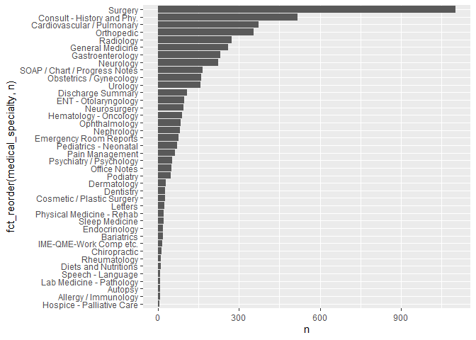
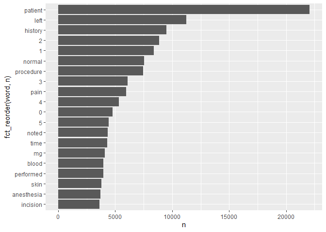
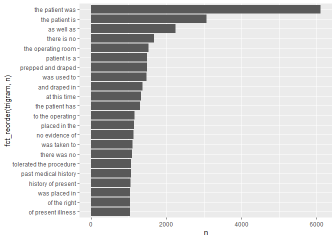

Lab 06
================
Carmen Chen
10/1/2021

\#\#Download the data

``` r
fn <- "mtsamples.csv"
if(!file.exists(fn))
  download.file("https://raw.githubusercontent.com/USCbiostats/data-science-data/master/00_mtsamples/mtsamples.csv", destfile = fn)

mtsamples <- read.csv(fn) #read data from a data frame
mtsamples <- as_tibble(mtsamples)
```

\#Question 1: What specialties do we have? We can use count() from dplyr
to figure out how many different catagories do we have? Are these
catagories related? overlapping? evenly distributed?

``` r
specialties <- mtsamples %>%
  count(medical_specialty)

specialties %>%
  arrange(desc(n)) %>%
  top_n(15) %>%
  knitr::kable()
```

    ## Selecting by n

| medical\_specialty            |    n |
|:------------------------------|-----:|
| Surgery                       | 1103 |
| Consult - History and Phy.    |  516 |
| Cardiovascular / Pulmonary    |  372 |
| Orthopedic                    |  355 |
| Radiology                     |  273 |
| General Medicine              |  259 |
| Gastroenterology              |  230 |
| Neurology                     |  223 |
| SOAP / Chart / Progress Notes |  166 |
| Obstetrics / Gynecology       |  160 |
| Urology                       |  158 |
| Discharge Summary             |  108 |
| ENT - Otolaryngology          |   98 |
| Neurosurgery                  |   94 |
| Hematology - Oncology         |   90 |

There are 40 specialties. Let’s take a look at the distribution:

``` r
#Method 1 (not that pretty)
ggplot(mtsamples, aes(x = medical_specialty)) +
  geom_histogram(stat = "count") +
  coord_flip() #for better reading the categories
```

    ## Warning: Ignoring unknown parameters: binwidth, bins, pad

<!-- -->

``` r
#Method 2
ggplot(specialties, aes(x = n, y = fct_reorder(medical_specialty, n))) + #x is frequency, y is the label, sorting the medical_specialty according to n
  geom_col() #plot column
```

<!-- -->

These are not evenly distributed.

\#Question 2 Tokenize the the words in the transcription column Count
the number of times each token appears Visualize the top 20 most
frequent words

``` r
mtsamples %>%
  unnest_tokens(output = word, input = transcription) %>%
  count(word, sort = TRUE) %>%
  top_n(20) %>%
  ggplot(aes(x = n, y = fct_reorder(word, n))) +
  geom_col()
```

    ## Selecting by n

<!-- -->

The word “patient” seems to be important, but we observe a lot of stop
words.

\#Question 3 Redo visualization but remove stopwords before Bonus points
if you remove numbers as well What do we see know that we have removed
stop words? Does it give us a better idea of what the text is about?

``` r
mtsamples %>%
  unnest_tokens(output = word, input = transcription) %>%
  count(word, sort = TRUE) %>%
  anti_join(stop_words, by = "word") %>%
  #using regular expressions to remove numbers
  filter(!grepl("^[0-9]+$", x = word)) %>% #"grepl" tells logical vector, "^" is the beginning of the word, "$" is the end of the word, "+" tells it should be repeated at least once
  top_n(20) %>%
  ggplot(aes(x = n, y = fct_reorder(word, n))) +
  geom_col()
```

    ## Selecting by n

<!-- -->

\#Question 4 repeat question 2, but this time tokenize into bi-grams.
how does the result change if you look at tri-grams?

``` r
library(Rcpp)
```

    ## Warning: package 'Rcpp' was built under R version 4.1.1

``` r
mtsamples %>%
  unnest_ngrams(output = bigram, input = transcription, n = 2) %>%
  count(bigram, sort = TRUE) %>%
  top_n(20) %>%
  ggplot(aes(x = n, y = fct_reorder(bigram, n))) +
  geom_col()
```

    ## Selecting by n

<!-- -->

``` r
mtsamples %>%
  unnest_ngrams(output = trigram, input = transcription, n = 3) %>%
  count(trigram, sort = TRUE) %>%
  top_n(20) %>%
  ggplot(aes(x = n, y = fct_reorder(trigram, n))) +
  geom_col()
```

    ## Selecting by n

<!-- -->

Now some phrases start to show up, e.g., “tolerated the procedure”,
“prepped and draped.”

\#Question 5 Using the results you got from questions 4. Pick a word and
count the words that appears after and before it.

``` r
bigrams <- mtsamples %>%
  unnest_ngrams(output = bigram, input = transcription, n = 2) %>%
  separate(bigram, into = c("w1", "w2")) %>%
  filter((w1 == "history") | (w2 == "history"))
```

    ## Warning: Expected 2 pieces. Additional pieces discarded in 31317 rows [600,
    ## 601, 738, 739, 981, 982, 984, 985, 991, 992, 1314, 1315, 1491, 1492, 2076, 2077,
    ## 2835, 2836, 3853, 3854, ...].

``` r
bigrams %>%
  filter(w1 == "history") %>%
  select(w1, w2) %>%
  count(w2, sort = TRUE)
```

    ## # A tibble: 366 x 2
    ##    w2                  n
    ##    <chr>           <int>
    ##  1 of               4537
    ##  2 the               761
    ##  3 she               279
    ##  4 he                227
    ##  5 significant       200
    ##  6 this              200
    ##  7 and               197
    ##  8 1                 181
    ##  9 is                172
    ## 10 noncontributory   121
    ## # ... with 356 more rows

``` r
bigrams %>%
  filter(w2 == "history") %>%
  select(w1, w2) %>%
  count(w2, sort = TRUE) 
```

    ## # A tibble: 1 x 2
    ##   w2          n
    ##   <chr>   <int>
    ## 1 history  9078

Since we are looking at single words agian, it is a good idea to treat
these as singe token. So let’s remove the stop words and numbers.

``` r
bigrams %>%
  filter(w1 == "history") %>% #keeping rows with history of first word
  filter(!(w2 %in% stop_words$word) & !grepl("^[0-9]+$", w2)) %>% #do not include words with stop words or numbers
  count(w2, sort = TRUE) %>%
  top_n(10) %>%
  knitr::kable() 
```

    ## Selecting by n

| w2              |   n |
|:----------------|----:|
| significant     | 200 |
| noncontributory | 121 |
| patient         | 106 |
| negative        |  96 |
| positive        |  87 |
| unremarkable    |  53 |
| hypertension    |  50 |
| includes        |  47 |
| mother          |  43 |
| history         |  42 |

``` r
bigrams %>%
  filter(w2 == "history") %>% #keeping rows with history of first word
  filter(!(w1 %in% stop_words$word) & !grepl("^[0-9]+$", w1)) %>% #do not include words with stop words or numbers
  count(w1, sort = TRUE) %>%
  top_n(10) %>%
  knitr::kable() 
```

    ## Selecting by n

| w1          |    n |
|:------------|-----:|
| medical     | 1223 |
| family      |  941 |
| social      |  865 |
| surgical    |  491 |
| pain        |   98 |
| psychiatric |   90 |
| prior       |   87 |
| past        |   80 |
| previous    |   72 |
| personal    |   55 |

\#Question 6 Which words are most used in each of the specialties. you
can use group\_by() and top\_n() from dplyr to have the calculations be
done within each specialty. Remember to remove stopwords. How about the
most 5 used words?

``` r
mtsamples %>%
  unnest_tokens(word, input = transcription) %>%
  group_by(medical_specialty) %>%
  count(word, sort = TRUE) %>%
  filter(!(word %in% stop_words$word) & !grepl("^[0-9]+$", word)) %>%
  top_n(5) %>%
  arrange(medical_specialty, desc(n)) %>%
  knitr::kable()
```

    ## Selecting by n

| medical\_specialty            | word         |    n |
|:------------------------------|:-------------|-----:|
| Allergy / Immunology          | history      |   38 |
| Allergy / Immunology          | noted        |   23 |
| Allergy / Immunology          | patient      |   22 |
| Allergy / Immunology          | allergies    |   21 |
| Allergy / Immunology          | nasal        |   13 |
| Allergy / Immunology          | past         |   13 |
| Autopsy                       | left         |   83 |
| Autopsy                       | inch         |   59 |
| Autopsy                       | neck         |   55 |
| Autopsy                       | anterior     |   47 |
| Autopsy                       | body         |   40 |
| Bariatrics                    | patient      |   62 |
| Bariatrics                    | history      |   50 |
| Bariatrics                    | weight       |   36 |
| Bariatrics                    | surgery      |   34 |
| Bariatrics                    | gastric      |   30 |
| Cardiovascular / Pulmonary    | left         | 1550 |
| Cardiovascular / Pulmonary    | patient      | 1516 |
| Cardiovascular / Pulmonary    | artery       | 1085 |
| Cardiovascular / Pulmonary    | coronary     |  681 |
| Cardiovascular / Pulmonary    | history      |  654 |
| Chiropractic                  | pain         |  187 |
| Chiropractic                  | patient      |   85 |
| Chiropractic                  | dr           |   66 |
| Chiropractic                  | history      |   56 |
| Chiropractic                  | left         |   54 |
| Consult - History and Phy.    | patient      | 3046 |
| Consult - History and Phy.    | history      | 2820 |
| Consult - History and Phy.    | normal       | 1368 |
| Consult - History and Phy.    | pain         | 1153 |
| Consult - History and Phy.    | mg           |  908 |
| Cosmetic / Plastic Surgery    | patient      |  116 |
| Cosmetic / Plastic Surgery    | procedure    |   98 |
| Cosmetic / Plastic Surgery    | breast       |   95 |
| Cosmetic / Plastic Surgery    | skin         |   88 |
| Cosmetic / Plastic Surgery    | incision     |   67 |
| Dentistry                     | patient      |  195 |
| Dentistry                     | tooth        |  108 |
| Dentistry                     | teeth        |  104 |
| Dentistry                     | left         |   94 |
| Dentistry                     | procedure    |   82 |
| Dermatology                   | patient      |  101 |
| Dermatology                   | skin         |  101 |
| Dermatology                   | cm           |   77 |
| Dermatology                   | left         |   58 |
| Dermatology                   | procedure    |   44 |
| Diets and Nutritions          | patient      |   43 |
| Diets and Nutritions          | weight       |   40 |
| Diets and Nutritions          | carbohydrate |   37 |
| Diets and Nutritions          | day          |   28 |
| Diets and Nutritions          | food         |   27 |
| Diets and Nutritions          | plan         |   27 |
| Discharge Summary             | patient      |  672 |
| Discharge Summary             | discharge    |  358 |
| Discharge Summary             | mg           |  301 |
| Discharge Summary             | history      |  208 |
| Discharge Summary             | hospital     |  183 |
| Emergency Room Reports        | patient      |  685 |
| Emergency Room Reports        | history      |  356 |
| Emergency Room Reports        | pain         |  273 |
| Emergency Room Reports        | normal       |  255 |
| Emergency Room Reports        | denies       |  149 |
| Endocrinology                 | thyroid      |  129 |
| Endocrinology                 | patient      |  121 |
| Endocrinology                 | left         |   63 |
| Endocrinology                 | history      |   57 |
| Endocrinology                 | dissection   |   45 |
| Endocrinology                 | gland        |   45 |
| Endocrinology                 | nerve        |   45 |
| ENT - Otolaryngology          | patient      |  415 |
| ENT - Otolaryngology          | nasal        |  281 |
| ENT - Otolaryngology          | left         |  219 |
| ENT - Otolaryngology          | ear          |  182 |
| ENT - Otolaryngology          | procedure    |  181 |
| Gastroenterology              | patient      |  872 |
| Gastroenterology              | procedure    |  470 |
| Gastroenterology              | history      |  341 |
| Gastroenterology              | normal       |  328 |
| Gastroenterology              | colon        |  240 |
| General Medicine              | patient      | 1356 |
| General Medicine              | history      | 1027 |
| General Medicine              | normal       |  717 |
| General Medicine              | pain         |  567 |
| General Medicine              | mg           |  503 |
| Hematology - Oncology         | patient      |  316 |
| Hematology - Oncology         | history      |  290 |
| Hematology - Oncology         | left         |  187 |
| Hematology - Oncology         | mg           |  107 |
| Hematology - Oncology         | mass         |   97 |
| Hospice - Palliative Care     | patient      |   43 |
| Hospice - Palliative Care     | mg           |   28 |
| Hospice - Palliative Care     | history      |   27 |
| Hospice - Palliative Care     | daughter     |   22 |
| Hospice - Palliative Care     | family       |   19 |
| Hospice - Palliative Care     | pain         |   19 |
| IME-QME-Work Comp etc.        | pain         |  152 |
| IME-QME-Work Comp etc.        | patient      |  106 |
| IME-QME-Work Comp etc.        | dr           |   82 |
| IME-QME-Work Comp etc.        | injury       |   81 |
| IME-QME-Work Comp etc.        | left         |   70 |
| Lab Medicine - Pathology      | cm           |   35 |
| Lab Medicine - Pathology      | tumor        |   35 |
| Lab Medicine - Pathology      | lymph        |   30 |
| Lab Medicine - Pathology      | lobe         |   29 |
| Lab Medicine - Pathology      | upper        |   20 |
| Letters                       | pain         |   80 |
| Letters                       | abc          |   71 |
| Letters                       | patient      |   65 |
| Letters                       | normal       |   53 |
| Letters                       | dr           |   46 |
| Nephrology                    | patient      |  348 |
| Nephrology                    | renal        |  257 |
| Nephrology                    | history      |  160 |
| Nephrology                    | kidney       |  144 |
| Nephrology                    | left         |  132 |
| Neurology                     | left         |  672 |
| Neurology                     | patient      |  648 |
| Neurology                     | normal       |  485 |
| Neurology                     | history      |  429 |
| Neurology                     | time         |  278 |
| Neurosurgery                  | patient      |  374 |
| Neurosurgery                  | c5           |  289 |
| Neurosurgery                  | c6           |  266 |
| Neurosurgery                  | procedure    |  247 |
| Neurosurgery                  | left         |  222 |
| Obstetrics / Gynecology       | patient      |  628 |
| Obstetrics / Gynecology       | uterus       |  317 |
| Obstetrics / Gynecology       | procedure    |  301 |
| Obstetrics / Gynecology       | incision     |  293 |
| Obstetrics / Gynecology       | normal       |  276 |
| Office Notes                  | normal       |  230 |
| Office Notes                  | negative     |  193 |
| Office Notes                  | patient      |   94 |
| Office Notes                  | history      |   76 |
| Office Notes                  | noted        |   60 |
| Ophthalmology                 | eye          |  456 |
| Ophthalmology                 | patient      |  258 |
| Ophthalmology                 | procedure    |  176 |
| Ophthalmology                 | anterior     |  150 |
| Ophthalmology                 | chamber      |  149 |
| Orthopedic                    | patient      | 1711 |
| Orthopedic                    | left         |  998 |
| Orthopedic                    | pain         |  763 |
| Orthopedic                    | procedure    |  669 |
| Orthopedic                    | lateral      |  472 |
| Pain Management               | patient      |  236 |
| Pain Management               | procedure    |  197 |
| Pain Management               | needle       |  156 |
| Pain Management               | injected     |   76 |
| Pain Management               | pain         |   76 |
| Pediatrics - Neonatal         | patient      |  247 |
| Pediatrics - Neonatal         | history      |  235 |
| Pediatrics - Neonatal         | normal       |  155 |
| Pediatrics - Neonatal         | child        |   82 |
| Pediatrics - Neonatal         | mom          |   82 |
| Physical Medicine - Rehab     | patient      |  220 |
| Physical Medicine - Rehab     | left         |  104 |
| Physical Medicine - Rehab     | pain         |   95 |
| Physical Medicine - Rehab     | motor        |   62 |
| Physical Medicine - Rehab     | history      |   54 |
| Podiatry                      | foot         |  232 |
| Podiatry                      | patient      |  231 |
| Podiatry                      | left         |  137 |
| Podiatry                      | tendon       |   98 |
| Podiatry                      | incision     |   96 |
| Psychiatry / Psychology       | patient      |  532 |
| Psychiatry / Psychology       | history      |  344 |
| Psychiatry / Psychology       | mg           |  183 |
| Psychiatry / Psychology       | mother       |  164 |
| Psychiatry / Psychology       | reported     |  141 |
| Radiology                     | left         |  701 |
| Radiology                     | normal       |  644 |
| Radiology                     | patient      |  304 |
| Radiology                     | exam         |  302 |
| Radiology                     | mild         |  242 |
| Rheumatology                  | history      |   50 |
| Rheumatology                  | patient      |   34 |
| Rheumatology                  | mg           |   26 |
| Rheumatology                  | pain         |   23 |
| Rheumatology                  | day          |   22 |
| Rheumatology                  | examination  |   22 |
| Rheumatology                  | joints       |   22 |
| Sleep Medicine                | sleep        |  143 |
| Sleep Medicine                | patient      |   69 |
| Sleep Medicine                | apnea        |   35 |
| Sleep Medicine                | activity     |   31 |
| Sleep Medicine                | stage        |   29 |
| SOAP / Chart / Progress Notes | patient      |  537 |
| SOAP / Chart / Progress Notes | mg           |  302 |
| SOAP / Chart / Progress Notes | history      |  254 |
| SOAP / Chart / Progress Notes | pain         |  239 |
| SOAP / Chart / Progress Notes | blood        |  194 |
| Speech - Language             | patient      |  105 |
| Speech - Language             | therapy      |   41 |
| Speech - Language             | speech       |   35 |
| Speech - Language             | patient’s    |   28 |
| Speech - Language             | evaluation   |   17 |
| Speech - Language             | goals        |   17 |
| Speech - Language             | term         |   17 |
| Speech - Language             | time         |   17 |
| Surgery                       | patient      | 4855 |
| Surgery                       | left         | 3263 |
| Surgery                       | procedure    | 3243 |
| Surgery                       | anesthesia   | 1687 |
| Surgery                       | incision     | 1641 |
| Urology                       | patient      |  776 |
| Urology                       | bladder      |  357 |
| Urology                       | procedure    |  306 |
| Urology                       | left         |  288 |
| Urology                       | history      |  196 |

\#Question 7 - extra Find your own insight in the data:

Ideas:

Interesting ngrams See if certain words are used more in some
specialties then others

\#How to push the file in Terminal using command lines: git add
lab06/README\* git status git commit -a -m “Starting with lab06” git
push

\#How to remove the file on track: git rm –cache -r lab06/README\_cache
